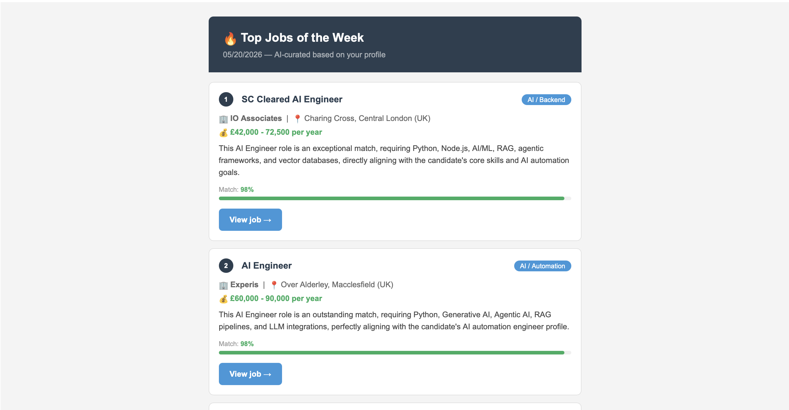

# 🔥 Job Finder

> A self-running workflow that aggregates remote job listings from multiple APIs, scores them against a custom developer profile using Gemini AI, and delivers a curated weekly digest via email.



---

## How it works

Every Sunday at 9AM, the workflow automatically:

1. **Fetches** job listings from multiple sources — Remotive, Arbeitnow, and Adzuna (UK + US)
2. **Normalizes** all listings into a unified format, deduplicating by ID
3. **Scores** each listing with Gemini 2.5 Flash based on a custom candidate profile
4. **Delivers** the top matches as a formatted HTML email with match scores, salary info, and direct links

---

## Stack

- **[n8n](https://n8n.io)** — workflow orchestration
- **[Gemini 2.5 Flash](https://ai.google.dev)** — AI-powered job scoring
- **Remotive API** — remote software dev jobs
- **Arbeitnow API** — European jobs with visa sponsorship
- **Adzuna API** — UK and US job listings
- **SMTP / Gmail** — email delivery

---

## Setup

### Prerequisites

- [n8n](https://docs.n8n.io/getting-started/installation/) installed locally or on a server
- Google Gemini API key ([get one here](https://aistudio.google.com/app/apikey))
- Adzuna API credentials ([register here](https://developer.adzuna.com))
- Gmail App Password for SMTP ([guide](https://support.google.com/accounts/answer/185833))

### Installation

1. Clone this repository
2. Open n8n and go to **Workflows → Import from file**
3. Import `job_finder_workflow.json`
4. Configure the credentials in n8n:
    - **Google Gemini (PaLM) API** — add your Gemini API key
    - **SMTP** — use `smtp.gmail.com`, port `465`, SSL enabled, and your Gmail App Password
5. Update the `fromEmail` and `toEmail` fields in the **Send an Email** node
6. Activate the workflow

The workflow runs automatically every Sunday at 9AM.

---

## Customization

To tailor the results to your profile, edit the prompt inside the **Message a model** node:

```
Skills: Python, FastAPI, JavaScript, React, Docker, GCP, Gemini AI, ChromaDB, RAG, n8n, REST APIs
Level: mid-level software developer / AI automation engineer
Goal: remote work paying in USD or EUR
Preferred: AI, automation, backend, fullstack roles
EXCLUDE: roles containing "Senior", "Lead", "Head", "Staff", "Director", "Manager", "Architect"
```

You can also add more job sources by adding HTTP Request nodes pointing to other APIs and connecting them to the Merge node.

---

## Email Preview

Each job card includes:

- Job title, company, and location
- Salary range (when available)
- One-line explanation of why it matches your profile
- Match score (0–100) with a visual progress bar
- Direct link to the job posting

---

## License

MIT
